  

  
  
  
  
  

 

  <table>
    <tr>
      <td align="center" width="310">
        
      </td>
      <td align="left">
        
      </td>
    </tr>
  </table>

## &nbsp; About

I'm a final-year **BIT (Hons.)** student at **HELP University**, Kuala Lumpur — and a developer who
refuses to stay in one lane. I build production web systems by day, immersive **XR** experiences for
my final-year project, and design and produce creative media under my own brand.

- Currently building a **VR Campus Tour** on **Meta Quest 3** — immersive 3D facility walkthroughs for prospective students
- Shipping **full-stack web platforms, business systems and CRMs** for real companies, not just coursework
- Exploring **agentic AI tooling** — `MorganaAI` is my voice-first personal assistant, built on Claude
- Blending **engineering with design** — UI/UX, media production, copywriting, and public speaking
- Operating **`yldi_production`**, my creative media brand
- Reach me at **surasesukesh@gmail.com**

## &nbsp; Languages &amp; Tools

  

## &nbsp; GitHub Stats

<!-- If these cards show as broken images, the free shared github-readme-stats instance is rate-limited.
     Fix permanently: deploy your own copy to Vercel (see SETUP.md section 7), then find-and-replace
     "github-readme-stats.vercel.app" below with your own Vercel domain. -->

## &nbsp; Contribution Snake

  <picture>
    <source media="(prefers-color-scheme: dark)"  srcset="https://raw.githubusercontent.com/Keshz28/Keshz28/output/snake-dark.svg" />
    <source media="(prefers-color-scheme: light)" srcset="https://raw.githubusercontent.com/Keshz28/Keshz28/output/snake-light.svg" />
    
  </picture>

## &nbsp; Experience

**Operations Manager** &nbsp;·&nbsp; SJ Sunrise Services
> Running day-to-day operations and coordination for the services business.

**IT Software Developer** &nbsp;·&nbsp; Sinar Jasa Trading
> Building and maintaining internal software and business systems.

**Information Technology Intern** &nbsp;·&nbsp; Bluedale Group of Companies
> Redeveloped the KL The Guide travel platform, built an admin dashboard and clients gallery, and ran QA across the live site.

## &nbsp; Featured Projects

  

  
  
  
  
  
  

## &nbsp; Education &amp; Certifications

| | Qualification | Institution |
|---|---|---|
| 🎓 | **BSc Information Technology (Hons.)** | HELP University — *final year* |
| 🗄️ | **Oracle Database SQL Certified Associate** | Oracle |
| 🗄️ | **Oracle Academy — Database Programming** | Oracle Academy |
| 🗄️ | **Oracle Academy — Database Design** | Oracle Academy |
| 📜 | **STPM** | Malaysian Higher School Certificate |
| 📜 | **SPM** | Malaysian Certificate of Education |

## &nbsp; Now Playing

  <!-- Replace BOTH copies of YOUR_SPOTIFY_USER_ID below with the uid from spotify-github-profile.kittinanx.com -->
  

## &nbsp; Connect

Open to **internships, freelance builds and collaboration** — web, XR, or creative media.

  

<i>Built and designed by Sukesh Surase · Kuala Lumpur, Malaysia</i>

